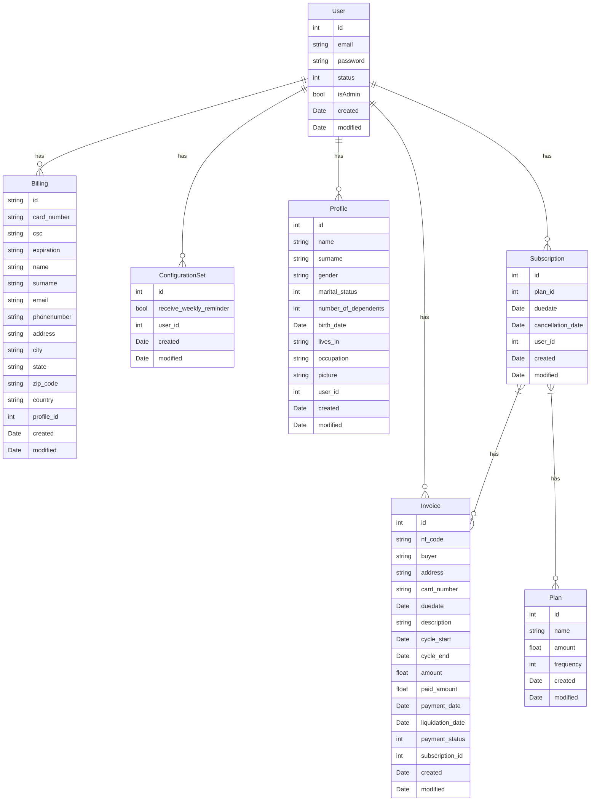

# Diagramas

## Entity Relationship Diagrams

```mermaid
erDiagram
    User {
        int id
        string email
        string password
        int status
        bool isAdmin
        Date created
        Date modified
    }

    Billing {
        string id
        string card_number
        string csc
        string expiration
        string name
        string surname
        string email
        string phonenumber
        string address
        string city
        string state
        string zip_code
        string country
        int profile_id
        Date created
        Date modified
    }

    ConfigurationSet {
        int id
        bool receive_weekly_reminder
        int user_id
        Date created
        Date modified
    }

    Profile {
        int id
        string name
        string surname
        string gender
        int marital_status
        int number_of_dependents
        Date birth_date
        string lives_in
        string occupation
        string picture
        int user_id
        Date created
        Date modified
    }

    Plan {
        int id
        string name
        float amount
        int frequency
        Date created
        Date modified
    }

    Subscription {
        int id
        int plan_id
        Date duedate
        Date cancellation_date
        int user_id
        Date created
        Date modified
    }

    Invoice {
        int id
        string nf_code
        string buyer
        string address
        string card_number
        Date duedate
        string description
        Date cycle_start
        Date cycle_end
        float amount
        float paid_amount
        Date payment_date
        Date liquidation_date
        int payment_status
        int subscription_id
        Date created
        Date modified
    }

    User ||--o{ Billing : has
    User ||--o{ ConfigurationSet : has
    User ||--o{ Profile : has
    User ||--o{ Invoice : has
    User ||--o{ Subscription : has
    Subscription }|--o{ Plan : has
    Subscription }|--o{ Invoice : has

```
