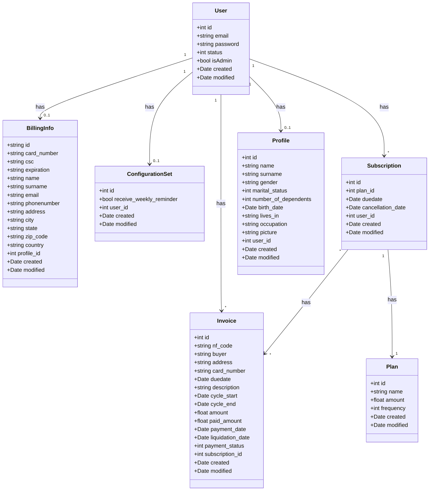
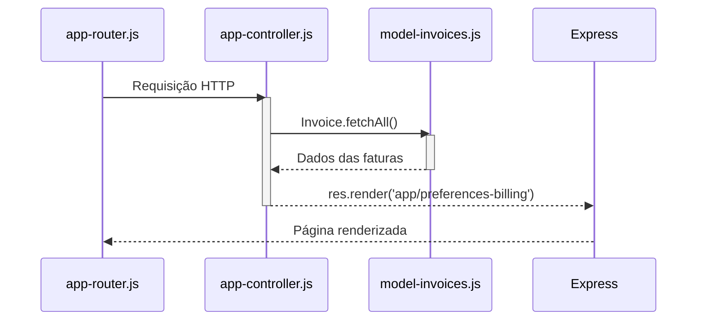

# The MVC Patter

[<< VOLTAR](README.md)

Using the MVC pattern to implement the "Subscriptions" and "Invoices" functionalities in a straightforward manner, not only will the files comprising the MVC itself be created, but also those that will handle the routes. The model will be implemented using a JSON file to persist the data.

## The data model

### The Class diagram of the features

## Entendeo o que será feito

[<< VOLTAR](README.md)
